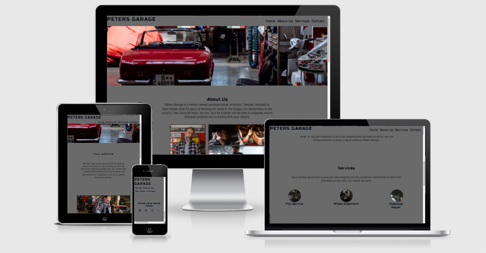
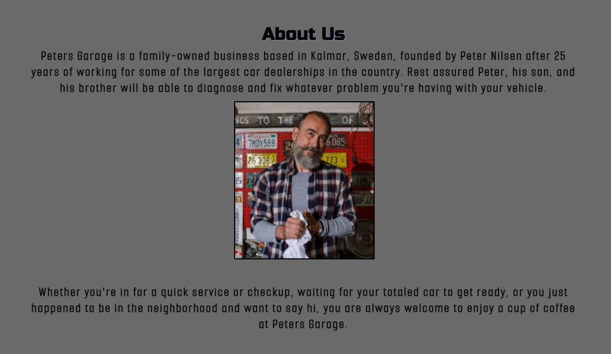
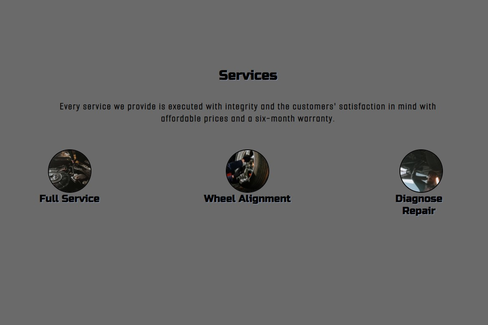
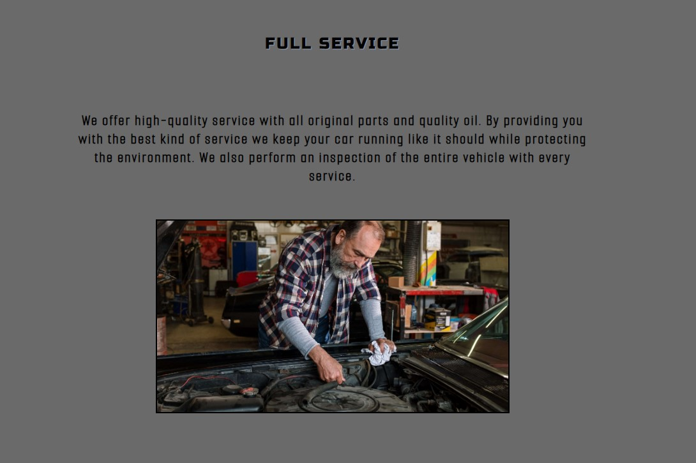
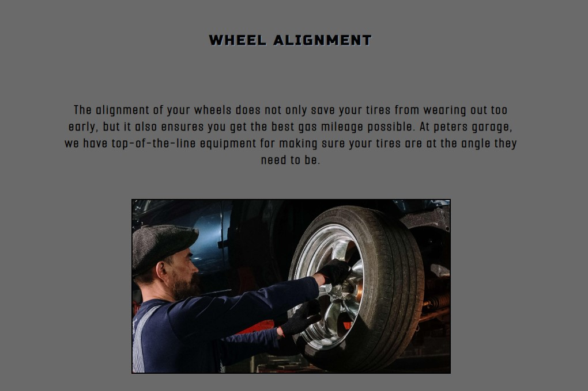
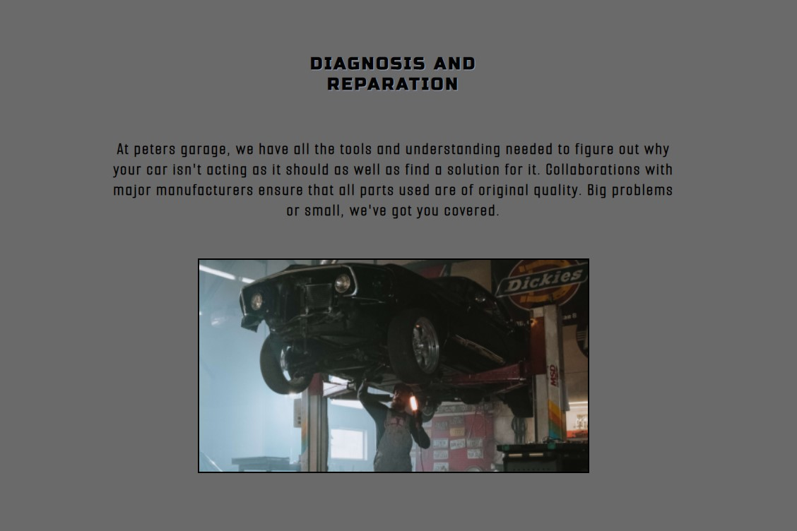
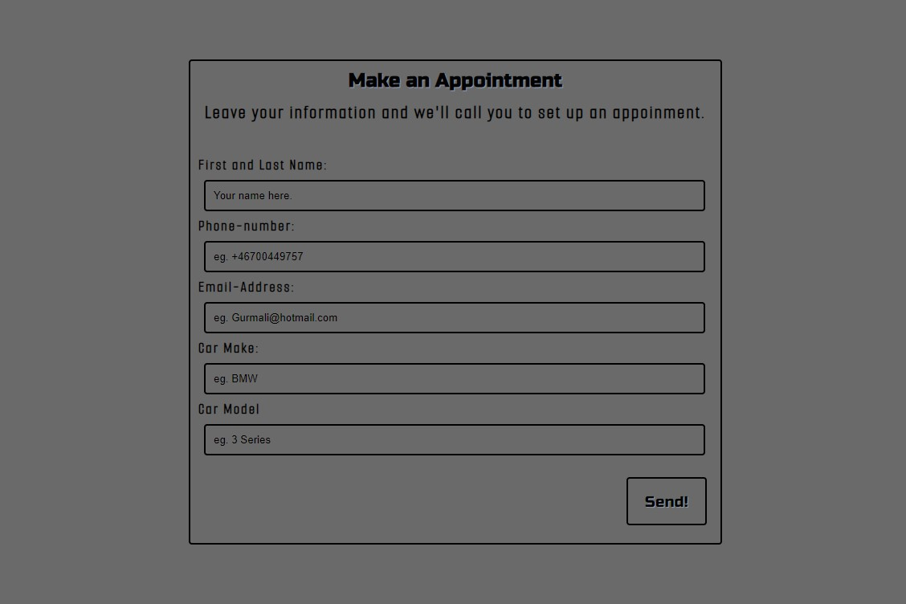

# Peters Garage 

Peters garage is a website made for a people who are looking to get work done to their car.

The site provides people with information about the company and the services they offer at peters garage, where to find them, how to get in touch and the hours they are open.

## Features

- __Navigation bar__

  - At the top of all four pages there is a navigation bar featured with a fixed position wich includes the logo and name of the workshop aswell as links to every section on the main page.

  - There is a link to the Home page, the About Us section, the Services section and the Contact section.

  - The navigation bar looks the same on all four pages and will stay at the top of the page no matter how far down the user scrolls.

- __Landing Page Image__

  - The landing page Shows a big picture of cars in a garage making it clear to the user what goes on at Peters Garage.

- __About Us Section__

  - The About Us section gives the user an explanation of who Peter and his co-workers are and why customers might want to get their car fixed at Peters Garage.

  - Pictures are included of Peter and his co-workers showing the dedication they put in on they're work.

- __Services section__

  - The Services section provides the user with three of the most common services performed at Peters Garage.

  - A full service of a vehicle.

  - A wheel alignment.

  - A diagnosis and reparation.

  - The three pictures are all working links that each have their own page when clicked.

- __Pages for the three services__

  - Each service has its own page explaining to the user with a paragraph of why you should get the service done at peters garage.

  - They all have a relevant picture to the service in question.

  - A fuctional form is included on every page encouraging the user to leave their information to get contacted for an appointment.

