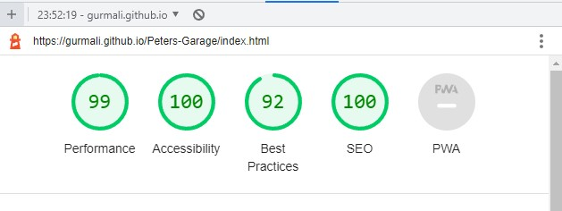

# Peters Garage 

Peters garage is a website made for a people who are looking to get work done to their car.

The site provides people with information about the company and the services they offer at peters garage, where to find them, how to get in touch and the hours they are open.

## Features

__Navigation bar__

- At the top of all four pages there is a navigation bar featured with a fixed position wich includes the logo and name of the workshop aswell as links to every section on the main page.

- There is a link to the Home page, the About Us section, the Services section and the Contact section.

- The navigation bar looks the same on all four pages and will stay at the top of the page no matter how far down the user scrolls.

__Landing Page Image__

- The landing page Shows a big picture of cars in a garage making it clear to the user what goes on at Peters Garage.

__About Us Section__

- The About Us section gives the user an explanation of who Peter and his co-workers are and why customers might want to get their car fixed at Peters Garage.

- Pictures are included of Peter and his co-workers showing the dedication they put in on they're work.

__Services section__

- The Services section provides the user with three of the most common services performed at Peters Garage.

  - A full service of a vehicle.

  - A wheel alignment.

  - A diagnosis and reparation.

- The three pictures are all working links that each have their own page when clicked.

__Pages for the three services__

- Each service has its own page explaining to the user with a paragraph of why you should get the service done at peters garage.

  - They all have a relevant picture to the service in question.

  - A fuctional form is included on every page encouraging the user to leave their information to get contacted for an appointment.

  - The form redirects the user to a Thank you page.

__Contact Section__

- The contact section contains information about how to get in touch with Peters Garage.

  - It provides clear information on what number to call and what email address the user can send an email to.

  - The address is also provided aswell as a zip code and the city where Peters Garage is located.

  - There is a clear text telling the user the hours the business is open.

__Footer Section__

- The Footer section contains links to different social media accounts assosiated with Peters garage.

  - There is a link to Facebook, Twitter, Youtube and Instagram.

 ## Testing

  - I have tested the website on multiple devices and confirmed that it looks good on a desktop, a laptop, an ipad and a mobilephone.

    - Given more time i could make the website look better on a phone.

  - I have tested and confirmed that the website works as intended on different browser.

    - Chrome, Firefox, Safari and Microsoft Edge. 

  - I have tested and confirmed that every internal and external link works as intended.

  - I have tested and confirmed that the form works as intended.

    - Requires entry in every field, only accepts an email in the email-field and only accept number in the phone-number field.

## Validator Testing 

- HTML 
  
   - No errors returned when passing through the official WC3 Validator.

- CSS

   - No errors returned when passing through The official (Jigsaw) Validator.

- Accessibility

  - I have tested and confirmed that the accessibility score is good by running it through Lighthouse in Dev-tools.

  - The performance score was a bit low to begin with but after some cleaning up of the code it looks alot better.

## Bugs 

- Was trying to give the logo some padding-top, could not make it happen even tho i applied the !important attribute so i left the bug unfixed.

## Deployment 

- The site was deployed to GitHub pages. The steps to deploy are as follows:

  - Go to the websites repository on GitHub.

  - In the GitHub repository navigate to the settings tab.

  - In the options, menu go to pages.

  - From the source section drop-down menu, select the main then click save.

  - (if the page doesn't refresh automatically) Refresh the page and a message will come up with a link to the website.

- The live link can be found here: https://gurmali.github.io/Peters-Garage/

## Credits

- Took inspiration and the code for social media links on the Footer section from the Love Running project.

## Media

- Most of the pictures used were taken from Pexels.com

- Hero Image taken from unsplash.com 

- Icons for the Contact section and Footer section taken from Font-Awesome
